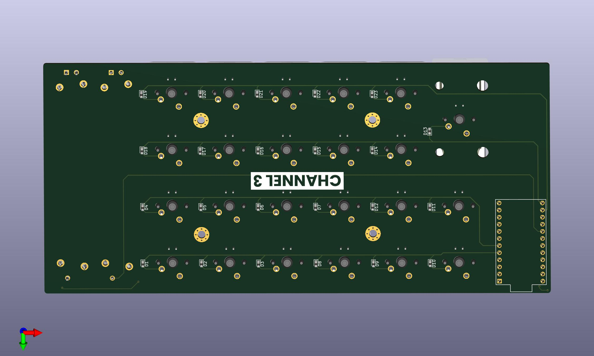

# Custom Keyboard Matrix PCB Design

This repository contains the files and resources for designing a custom keyboard matrix PCB using KiCad. The project includes detailed schematics, PCB layout, and necessary production files, making it easy to build and customize a keyboard.



## Project Overview

This project aims to design a custom keyboard matrix, including:

- **Schematic Design**: Layout of the electrical connections and components.
- **PCB Layout**: Designing the board with correct placements and routing for each component.
- **Production Files**: Includes Gerber files for manufacturing, and a BOM (Bill of Materials) listing all components required for the build.

## Folder Structure

- `schematics/`: KiCad schematic files for the keyboard matrix design.
- `pcb_layout/`: KiCad PCB layout files.
- `gerber_files/`: Files for PCB production.
- `bom/`: Bill of Materials in CSV format for ordering components.

## Getting Started

To view and edit this project, you will need [KiCad](https://kicad.org/download/) installed on your machine.

1. Clone this repository:
   ```bash
   git clone <repository-url>
   cd <repository-folder>
   ```
2. Open the project in KiCad by loading the `.kicad_pro` file in the root directory.

## Usage

# Modifying the Schematic

To modify the schematic, open the files in the `schematics/` folder and edit as required. Update connections, components, or footprints as needed.

# PCB Layout

The `pcb_layout/` folder contains the board layout, with all necessary routing, component placements, and constraints.

# Generating New Gerber Files

After making changes, generate new Gerber files for production by following these steps in KiCad: 1. Open the PCB Editor. 2. Go to File -> Plot and choose your output options. 3. Save the Gerber files in the `gerber_files/` folder.

# License

This project is licensed under the MIT License - see the [LICENSE](https://martinwainaina.xyz/) file for details.

Let me know if you need further modifications!
